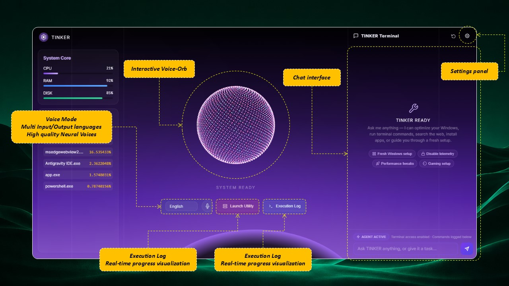
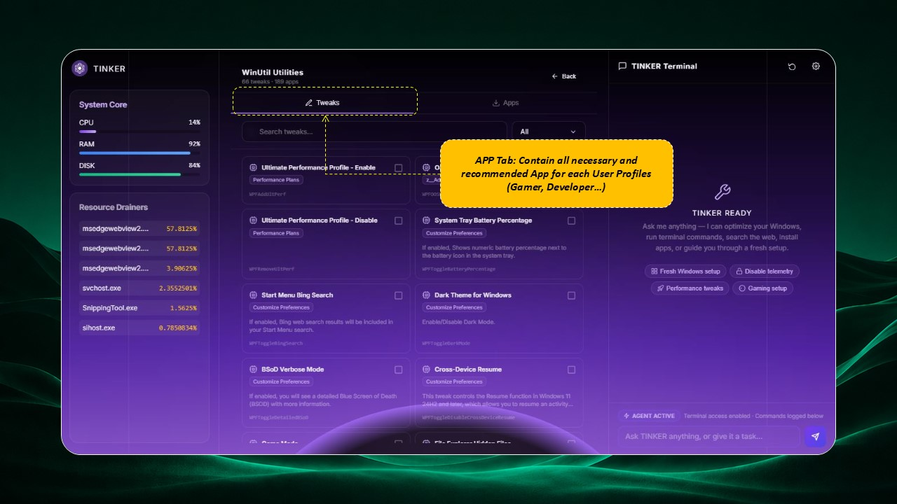
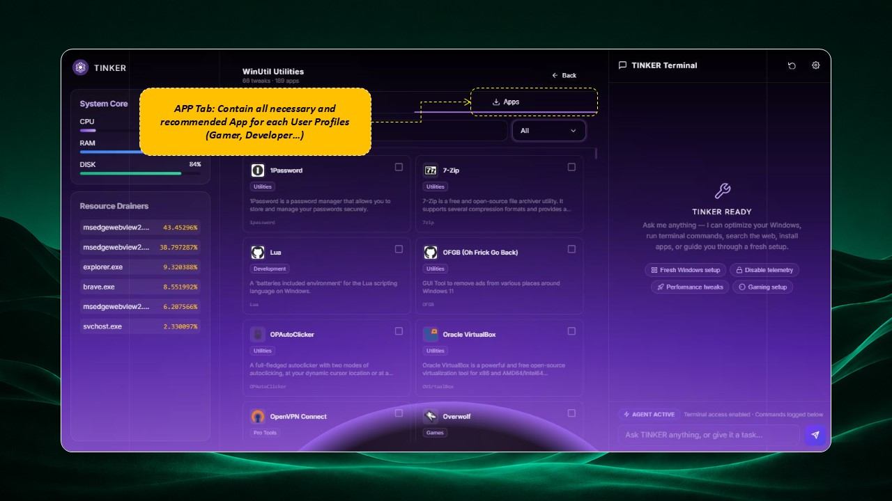
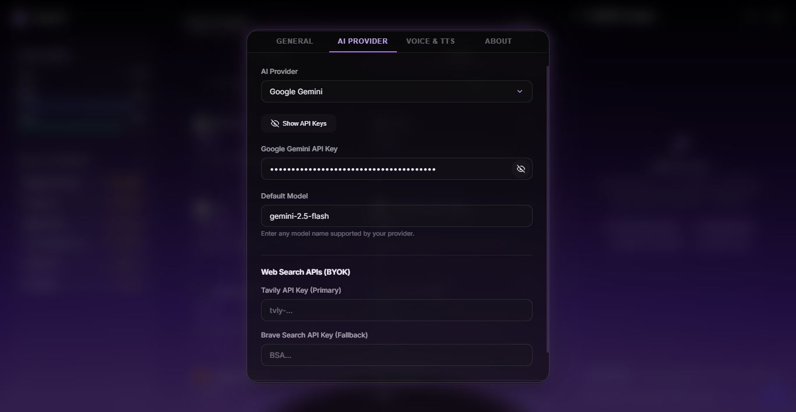

# ⚡ Tinker AI

<p align="center">
  
</p>

<h3 align="center">Tinker AI</h3>
<p align="center">
  <strong>A premium, agentic desktop assistant for Windows designed to automate system tuning, software management, and diagnostics using natural language.</strong>
</p>

<p align="center">
  
  
  
  
  
</p>

## 📥 Download & Quick Install

Get the latest version of Tinker AI for Windows:

* **[Download Setup Installer (.exe)](https://github.com/okba-boubakeur/TINKER/releases/latest)** — Direct installer for 64-bit Windows.
* **[Download MSI Installer (.msi)](https://github.com/okba-boubakeur/TINKER/releases/latest)** — Alternative installer database format.

### Quick Start Guide:
1. **Run the Installer:** Download and execute the `.exe` setup package. Follow the prompt to install the application on your computer.
2. **Configure API Keys:** Upon launch, click on the **Settings** gear icon. Enter your **Google Gemini Key** or **OpenRouter Key** to initialize the AI.
3. **WinUtil Catalog Setup:** Tinker AI references the WinUtil JSON library. Set the directory path in Settings to point to your local Chris Titus Tech repository containing the configuration catalogs (default: `D:\tinker-ai\winutil`).

---

Tinker AI blends real-time system monitoring, Chris Titus Tech's **WinUtil** automation catalog, and Vercel's **AI SDK** into a cohesive, high-performance desktop control center. Speak or type commands in natural language, and let the autonomous agent handle everything from installing apps to applying system tweaks—safely, securely, and silently.

## 💡 How It Works

You can ask the AI agent to solve any system issue or manage software! The AI will:
1. ⚙️ **Use WinUtil Tools:** Leverage Chris Titus Tech's optimized tweaks and tools library.
2. 📚 **Use Knowledge Base:** Refer to built-in system diagnostics and guidebooks.
3. 🌐 **Autonomous Web Search:** Safely search the web for the most appropriate solution to your unique issue.
4. 🛡️ **Ask Permission:** Always present planned commands for your explicit execution approval.
5. 🛠️ **Solve Almost Any Issue:** Execute silent application installations, registry fixes, or custom script operations.

---

## 📸 Screenshots

<p align="center">
  <strong>Overview</strong><br/>
  
</p>

<hr/>

<p align="center">
  <strong>Steps & Progression</strong><br/>
  
</p>

<hr/>

<p align="center">
  <strong>Tweaks Panel</strong><br/>
  
</p>

<hr/>

<p align="center">
  <strong>Software & Apps Panel</strong><br/>
  
</p>

<hr/>

<p align="center">
  <strong>Settings & API Options</strong><br/>
  
</p>

<hr/>

<p align="center">
  <strong>Execution Log Terminal</strong><br/>
  
</p>

---

## ✨ Key Features

### 1. 🤖 Autonomous AI Agent Loop
* **Natural Language Control:** Converse naturally to request system tweaks, ask troubleshooting questions, or install applications.
* **Smart Planning & Confirmation:** The agent constructs step-by-step plans. Sensitive commands require your explicit confirmation before executing.
* **Multi-Provider LLM Integration:** Connect to **Google Gemini** or **OpenRouter** to use your preferred model (e.g., Gemini 2.5 Flash, Claude 3.5 Sonnet).

### 2. 🎙️ 3D Voice Assistant & Orb
* **Interactive 3D Orb:** A beautiful, responsive 3D visualizer powered by React Three Fiber (R3F) and custom shaders that reacts dynamically to voice/agent states (Idle, Listening, Processing, Speaking).
* **Multilingual Speech Recognition:** Integrated Web Speech API support for seamless hands-free voice commands.
* **Neural Text-to-Speech:** Integrated with **Edge TTS** utilizing high-quality Microsoft Edge neural voices for smooth, natural audio replies.

### 3. ⚙️ WinUtil Automation Catalog
* **System Tweaks:** Run registry modifications, performance tweaks, and custom system configurations from the Chris Titus Tech catalog.
* **Software Management:** Install and uninstall Windows software silently using the **Windows Package Manager (Winget)**.
* **Manual Control Panel:** A clean, categorized UI listing to let you browse and execute tasks manually if preferred.

### 4. 📊 Real-Time System Monitoring
* **Performance Overview:** Real-time dashboards tracking global CPU, RAM, and main disk drive (C:\) usage.
* **Process Monitor:** View top resource-consuming tasks updating dynamically in real time.

### 5. 🔍 Secure Web & Shell Tools
* **Troubleshooting Search:** Leverages **Tavily** or **Brave Search** to find up-to-date solutions for system errors.
* **Sandboxed Powershell Execution:** Safe command-line tool with a robust blocklist to prevent destructive actions (e.g., format volume, disk clears).
* **Execution Log Terminal:** A resizable output console displaying real-time command logs, outputs, and inputs.

---

## 🛠️ Tech Stack

* **Frontend:** React 19, Vite, Tailwind CSS, React Markdown
* **3D Visuals:** Three.js, React Three Fiber (`@react-three/fiber`), `@react-three/drei`
* **Desktop Wrapper:** Tauri v2 (Rust runtime, system event emitting, native window management)
* **AI Orchestration:** Vercel AI SDK (`ai`), `@ai-sdk/google`, `@ai-sdk/openai`, `@ai-sdk/anthropic`
* **System Metrics:** Rust `sysinfo` crate
* **Voice Bindings:** Edge TTS via Rust CLI/bindings

---

## 🚀 Getting Started

### Prerequisites
Before running or building Tinker AI, ensure you have the following installed on your Windows machine:
1. **Node.js** (v18 or higher recommended)
2. **Rust & Cargo** (via [rustup.rs](https://rustup.rs/))
3. **C++ Build Tools** (Visual Studio with "Desktop development with C++" workload)
4. **WinUtil Catalog Setup:** By default, Tinker AI expects Chris Titus Tech's WinUtil configuration folder to exist locally (default: `d:\tinker-ai\winutil`). This must contain:
   * `winutil/config/tweaks.json`
   * `winutil/config/applications.json`

### Installation
1. Clone the repository:
   ```bash
   git clone https://github.com/okba-boubakeur/tinker-ai.git
   cd tinker-ai
   ```
2. Install dependencies:
   ```bash
   npm install
   ```

### Running Locally
To launch Tinker AI in development mode with hot-reloading:
```bash
npm run tauri dev
```

### Building for Production
To bundle a production-ready `.exe` installer:
```bash
npm run build
npm run tauri build
```

---

## ⚙️ Configuration & Settings

Inside the app, access the **Settings** panel to configure:
* **API Providers:** Supply your **Google Gemini** or **OpenRouter** API key.
* **Model Choice:** Pick the model you want the agent to use.
* **Web Search:** Enter your **Tavily** or **Brave Search** API key.
* **TTS Voice:** Select your preferred spoken output voice and language.
* **WinUtil Path:** Specify the folder path pointing to your local WinUtil configuration folder.

---

## 📁 Project Structure

```
├── src/                      # Frontend Application (React)
│   ├── components/           # UI Components (Orb, Chat, Panel, Cards, Modals)
│   ├── lib/                  # Agent Loop, AI Handlers, Task Queues, TTS
│   ├── App.jsx               # Main React Application
│   └── index.css             # Theme config & design system tokens
├── src-tauri/                # Tauri Backend (Rust)
│   ├── src/
│   │   ├── lib.rs            # Rust commands (Sysinfo, Shell executor, WinUtil parsers)
│   │   ├── tts.rs            # Edge TTS bindings
│   │   └── main.rs           # Entrypoint
│   └── tauri.conf.json       # Tauri app configurations
├── winutil/                  # Winutil Catalogs Configuration Path (Default)
└── package.json              # App package dependencies & build commands
```

---

## 🛡️ Security & Guardrails

* **Explicit Prompt Confirmation:** The AI agent cannot execute shell commands without requesting your approval via a dialog prompt.
* **Command Blocklist:** Destructive actions (such as formatting volumes, wiping drives, or root folder deletions) are blocked by the Rust backend.

---

## 🤝 Contributing

Contributions are what make the open-source community such an amazing place to learn, inspire, and create. Any contributions you make are **greatly appreciated**.

Please see [CONTRIBUTING.md](file:///e:/Apps-Portfolio/1- AI-Apps/tinker-ai/CONTRIBUTING.md) for details on our development setup and guidelines.

---

## 📄 License
This project is licensed under the MIT License - see the LICENSE file for details.

